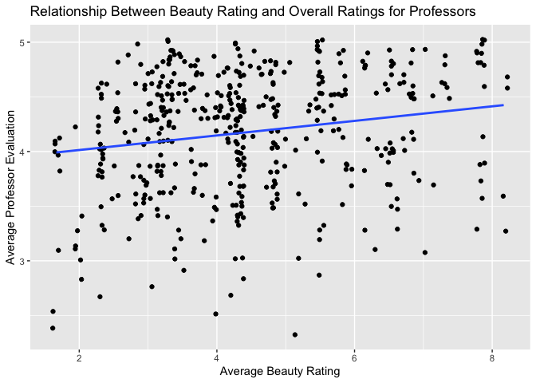

Lab 09 - Grading the professor, Pt. 1
================
Fiona Wang
Mar-20-2025

## Load Packages and Data

``` r
library(tidyverse) 
library(tidymodels)
library(openintro)
```

## Exercise 1 Getting to know the data

``` r
data <- evals
```

``` r
data %>% 
  ggplot(aes(x = score)) + geom_histogram(binwidth = 0.1, color = "black")
```

<!-- -->

As we can see from the graph, the majority of the data is on the right,
and the tail extends to the left. Thus it is left-skewed. It doesn’t
show me a lot of details about students’ rate. I want to include a
boxplot and the summary statistics here too.

``` r
data %>% 
  ggplot(aes(y = score)) + geom_boxplot()
```

<!-- -->

``` r
summary(data$score)
```

    ##    Min. 1st Qu.  Median    Mean 3rd Qu.    Max. 
    ##   2.300   3.800   4.300   4.175   4.600   5.000

The mean rating is 4.18. Students were, on average, pretty satisfied
with their professors. With a max of 5, and a min of 2.3. There are also
3 outliers on the lower end according to the boxplot. This is what I
expected. Students rated on 463 courses taught by 94 professors, so I
expected this variance. I think an average of 4.18 is fair and pretty
good.

## Exercise 2 Visual

``` r
data %>% 
  ggplot(aes(x = bty_avg, y = score)) + geom_point(alpha = 0.2, color = "blue") + 
  labs(title = "Relationship Between Beauty Rating and Overall Ratings for Professors")
```

<!-- -->

I made the dots transparent. For the darker dots, it means that more
people rated appearance and score that way. According to this graph, I
think there is a positive relationship between score and beauty rating.
However, it’s not very clear. There could be no relationship too because
the dots are pretty scattered all over the place.

### Exercise 3 Visual improve

``` r
data %>% 
  ggplot(aes(x = bty_avg, y = score)) + geom_jitter() + 
  labs(title = "Relationship Between Beauty Rating and Overall Ratings for Professors")
```

<!-- -->

I don’t know what jitter means, so I looked it up in the Help panel. It
says that jitter “adds a small amount of random variation to the
location fo each point”. It can help with reducing overlap, especially
for our dataset which has a lot of overlapping points. This means that
the first graph might be misleading because we can’t see all the data as
they were stacked on top of each other. However, I made the dots
transparent, so I still retained this information.

### Exercise 4 Beauty model

``` r
m_bty <- linear_reg() %>% 
  set_engine("lm") %>% 
  fit(score ~ bty_avg, data = data)
tidy(m_bty)
```

    ## # A tibble: 2 × 5
    ##   term        estimate std.error statistic   p.value
    ##   <chr>          <dbl>     <dbl>     <dbl>     <dbl>
    ## 1 (Intercept)   3.88      0.0761     51.0  1.56e-191
    ## 2 bty_avg       0.0666    0.0163      4.09 5.08e-  5

From the output table, the linear model will be: score = 3.88 +
0.067(bty_avg)

### Exercise 5 Visual with regression line

``` r
data %>% 
  ggplot(aes(x = bty_avg, y = score)) + geom_jitter() + geom_smooth(method = "lm", se = FALSE) + 
  labs(title = "Relationship Between Beauty Rating and Overall Ratings for Professors",
       x = "Average Beauty Rating",
       y = "Average Professor Evaluation")
```

<!-- -->

### Exercise 6 Interpreting the slope

Looking at the table from exercise 4, the slope of the linear model is
0.0666. This means that with one unit increase in average beauty rating,
there will be a 0.0666 unit increase in the average professor
evaluation.

### Exercise 7 Interpreting the intercept

Again, looking at the table from exercise 4, the intercept is 3.88. This
means that when there is a 0 for the average beauty rating for a
professor, the average professor evaluation (score) is 3.88.
Theoretically, this makes sense. However, in the context of this data,
the intercept doesn’t make sense. I checked the description of this
data. The beauty ratings are from 1-10. Thus, there wouldn’t be a 0 for
the average beauty rating.

### Exercise 8 Interpreting R^2

``` r
glance(m_bty)
```

    ## # A tibble: 1 × 12
    ##   r.squared adj.r.squared sigma statistic   p.value    df logLik   AIC   BIC
    ##       <dbl>         <dbl> <dbl>     <dbl>     <dbl> <dbl>  <dbl> <dbl> <dbl>
    ## 1    0.0350        0.0329 0.535      16.7 0.0000508     1  -366.  738.  751.
    ## # ℹ 3 more variables: deviance <dbl>, df.residual <int>, nobs <int>

The R^2 is 0.035. Sine we only have one predictor, I just looked at the
R^2, and not the adjusted R^2. This means that the average beauty rating
explained 3.5% of the variance in the average professor evaluation.

### Exercise 9 Gender model and interpretation

``` r
m_gen <- linear_reg() %>% 
  set_engine("lm") %>% 
  fit(score ~ gender, data = data)
tidy(m_gen)
```

    ## # A tibble: 2 × 5
    ##   term        estimate std.error statistic p.value
    ##   <chr>          <dbl>     <dbl>     <dbl>   <dbl>
    ## 1 (Intercept)    4.09     0.0387    106.   0      
    ## 2 gendermale     0.142    0.0508      2.78 0.00558

The linear model:  
y = 4.093 + 0.142x  
Score = 4.093 + 0.142(gender)  
The slope is 0.142. This means that with one unit increase in gender,
the score increases by 0.142 unit. However, I cannot tell from the data
the numeric representation for each gender. The intercept is 4.093. This
means that when the gender is 0, the average professor evaluation score
is 4.093.  
I am curious to find out which gender is represented by 0. Let’s
calculate the mean score for each gender.

``` r
data %>% 
  group_by(gender) %>% 
  summarise(mean_score = mean(score, na.rm = TRUE))
```

    ## # A tibble: 2 × 2
    ##   gender mean_score
    ##   <fct>       <dbl>
    ## 1 female       4.09
    ## 2 male         4.23

As we see from the table, females have an average score of 4.0928. This
tells me that females are denoted as 0, and males as 1. Now let’s
interpret the slope and intercept once again with this information in
mind. We have an intercept of 4.093. This means that females had an
average of 4.093 in score. Males, on average, had a 0.142 higher score
in rating than females. The 0 here makes sense in the context of the
data.

## Hint

For Exercise 12, the `relevel()` function can be helpful!
