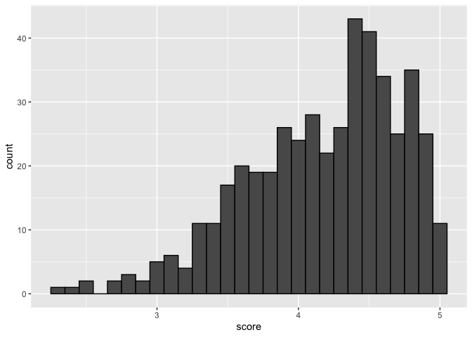
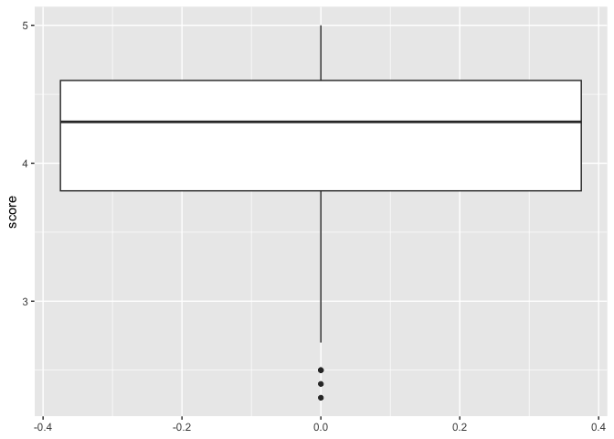
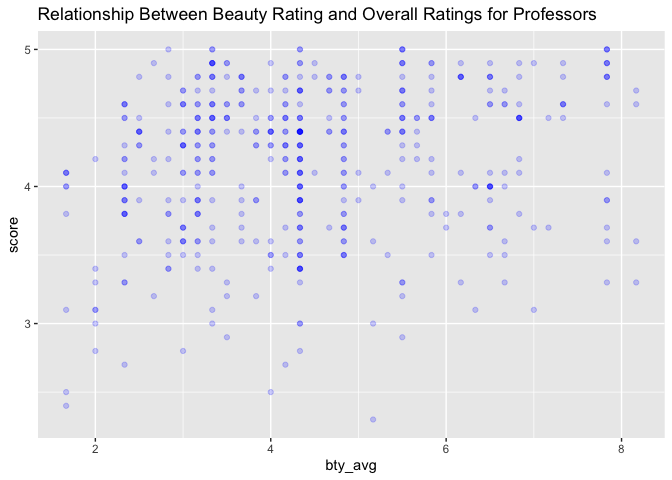
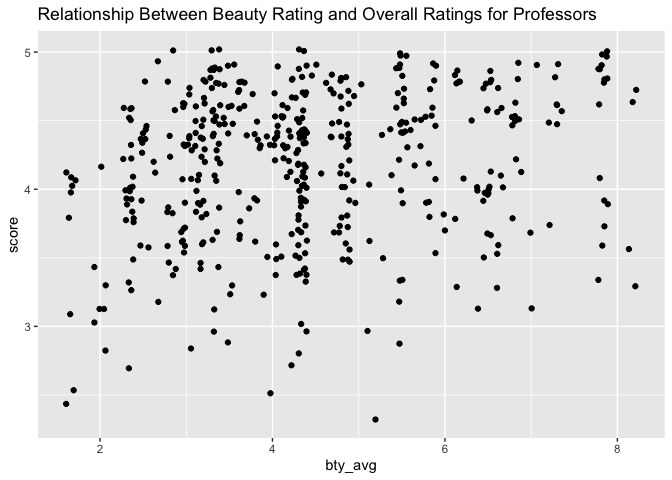

Lab 09 - Grading the professor, Pt. 1
================
Fiona Wang
Mar-20-2025

## Load Packages and Data

``` r
library(tidyverse) 
library(tidymodels)
library(openintro)
```

## Exercise 1

``` r
data <- evals
```

``` r
data %>% 
  ggplot(aes(x = score)) + geom_histogram(binwidth = 0.1, color = "black")
```

<!-- -->

As we can see from the graph, the majority of the data is on the right,
and the tail extends to the left. Thus it is left-skewed. It doesn’t
show me a lot of details about students’ rate. I want to include a
boxplot and the summary statistics here too.

``` r
data %>% 
  ggplot(aes(y = score)) + geom_boxplot()
```

<!-- -->

``` r
summary(data$score)
```

    ##    Min. 1st Qu.  Median    Mean 3rd Qu.    Max. 
    ##   2.300   3.800   4.300   4.175   4.600   5.000

The mean rating is 4.18. Students were, on average, pretty satisfied
with their professors. With a max of 5, and a min of 2.3. There are also
3 outliers on the lower end according to the boxplot. This is what I
expected. Students rated on 463 courses taught by 94 professors, so I
expected this variance. I think an average of 4.18 is fair and pretty
good.

## Exercise 2

``` r
data %>% 
  ggplot(aes(x = bty_avg, y = score)) + geom_point(alpha = 0.2, color = "blue") + 
  labs(title = "Relationship Between Beauty Rating and Overall Ratings for Professors")
```

<!-- -->

I made the dots transparent. For the darker dots, it means that more
people rated appearance and score that way. According to this graph, I
think there is a positive relationship between score and beauty rating.
However, it’s not very clear. There could be no relationship too because
the dots are pretty scattered all over the place.

### Exercise 3

``` r
data %>% 
  ggplot(aes(x = bty_avg, y = score)) + geom_jitter() + 
  labs(title = "Relationship Between Beauty Rating and Overall Ratings for Professors")
```

<!-- -->

I don’t know what jitter means, so I looked it up in the Help panel. It
says that jitter “adds a small amount of random variation to the
location fo each point”. It can help with reducing overlap, especially
for our dataset which has a lot of overlapping points. This means that
the first graph might be misleading because we can’t see all the data as
they were stacked on top of each other. However, I made the dots
transparent, so I still retained this information.

## Additional Exercises

*Repeat the format above for additional exercises.*

## Hint

For Exercise 12, the `relevel()` function can be helpful!
